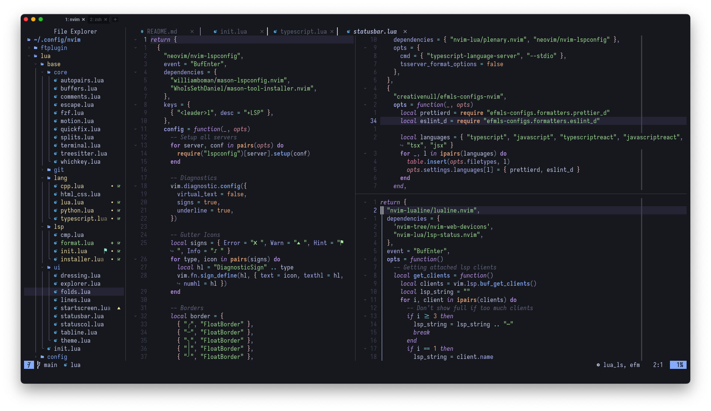

# Personal Neovim config

## Tools
- Plugin Manager: [Lazy](https://github.com/folke/lazy.nvim)
- Colorscheme: [Catppuccin Mocha](https://github.com/catppuccin/nvim)
- Font: IosevkaTerm Nerd Font
- FZF: [Telescope](https://github.com/nvim-telescope/telescope.nvim)
- Statusline: [Lualine](https://github.com/nvim-lualine/lualine.nvim)
- Tree Explorer: [Neotree](https://github.com/nvim-neo-tree/neo-tree.nvim)
- Tabline: [Bufferline](https://github.com/akinsho/bufferline.nvim)
- Formatting/Linting: [efm-ls](https://github.com/creativenull/efmls-configs-nvim)

## Configured Languages
- Python
    - ruff-lsp
    - pyright
    - black
- Lua
    - lua\_ls
    - stylua
- C/C++
    - clangd
    - clang-format
- JS/TS
    - [Typescript Tools](https://github.com/pmizio/typescript-tools.nvim)
    - prettierd
    - eslintd
